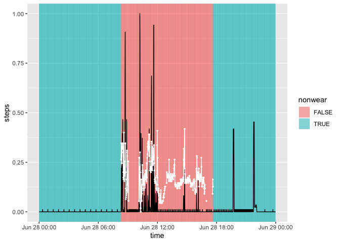
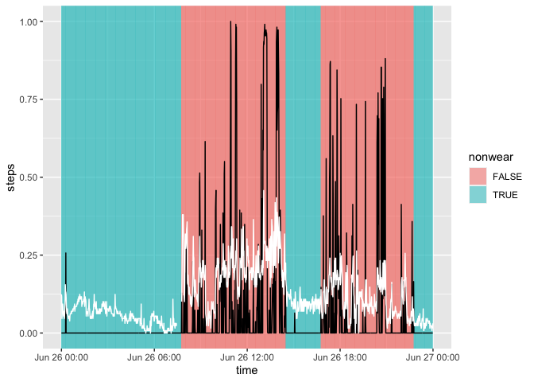
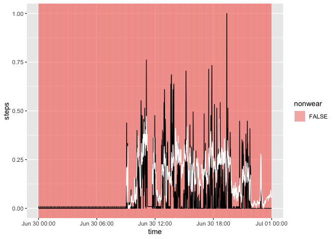
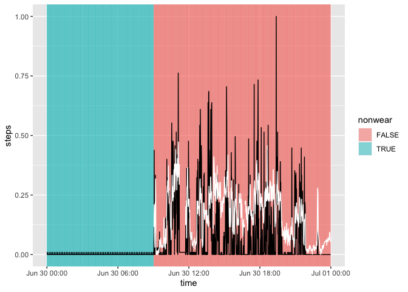
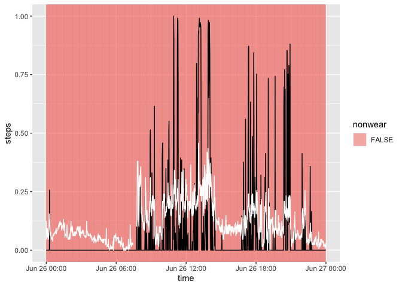
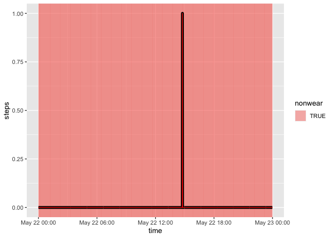
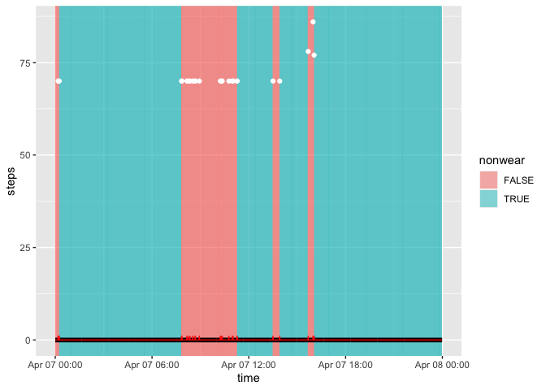

# flag_nonwear


```r
library(tidyverse)
library(magrittr)
library(fitibble)
```


```r
minute_data <- readRDS("../../data/prep/minute_data__export_1.rds")
```

## choi HR


```r
#apply flag_choi directly to missing HR
minute_data %<>% 
  group_by(id) %>% 
  mutate(nonwear = flag_choi(1 - is.na(HR))) %>% 
  ungroup()

minute_data %>% 
  group_by(id) %>% 
  summarise(
    n = n(), 
    is_zero_steps = sum(steps == 0), 
    nonwear = sum(nonwear), 
    is_na_HR = sum(is.na(HR))
  )
```

```
## # A tibble: 4 × 5
##      id       n is_zero_steps nonwear is_na_HR
##   <int>   <int>         <int>   <int>    <int>
## 1     1 1369440       1335428 1019088  1024505
## 2     2   89280         71334   33054    34846
## 3     3  414720        388950  259918   261716
## 4     4  243360        241509   20983    24958
```


```r
#choose example
minute_data %>% 
  filter(id == 2) %>% 
  mutate(date = as.Date(time)) %>% 
  group_by(id, date) %>% 
  summarise(diff = sum(nonwear) - sum(is.na(HR))) %>% 
  arrange(diff) %>% 
  head(1)
```

```
## `summarise()` has grouped output by 'id'. You can override using the `.groups` argument.
```

```
## # A tibble: 1 × 3
## # Groups:   id [1]
##      id date        diff
##   <int> <date>     <int>
## 1     2 2019-06-28  -114
```

```r
minute_data %>% 
  mutate(date = as.Date(time)) %>% 
  filter(id == 2, date == as.Date("2019-06-28")) %>% 
  mutate(
    xmin = time, 
    xmax = lag(time), 
    nonwear = as.factor(nonwear), 
    steps = (steps - min(steps)) / max(steps), 
    HR = (HR - min(HR, na.rm = T)) / max(HR, na.rm = T)
    ) %>% 
  select(time, xmin, xmax, nonwear, steps, HR)  %>% 
  ggplot() + 
  geom_rect(aes(xmin=xmin, xmax=xmax, ymin=-Inf, ymax=Inf, fill=nonwear), alpha = 0.5) + 
  geom_line(aes(x = time, y = steps)) + 
  geom_point(aes(x = time, y = HR), color = "white", size = 0.5) + 
  geom_line(aes(x = time, y = HR), color = "white")
```

```
## Warning: Removed 1 rows containing missing values (geom_rect).
```

```
## Warning: Removed 994 rows containing missing values (geom_point).
```

```
## Warning: Removed 880 row(s) containing missing values (geom_path).
```

<!-- -->


```r
#apply flag_choi_HR

minute_data %<>% 
  group_by(id) %>% 
  mutate(nonwear = flag_choi_HR(HR)) %>% 
  ungroup()

minute_data %>% 
  group_by(id) %>% 
  summarise(
    n = n(), 
    is_zero_steps = sum(steps == 0), 
    nonwear = sum(nonwear), 
    is_na_HR = sum(is.na(HR))
  )
```

```
## # A tibble: 4 × 5
##      id       n is_zero_steps nonwear is_na_HR
##   <int>   <int>         <int>   <int>    <int>
## 1     1 1369440       1335428 1019088  1024505
## 2     2   89280         71334   33054    34846
## 3     3  414720        388950  259918   261716
## 4     4  243360        241509   20983    24958
```


```r
minute_data %>% 
  mutate(date = as.Date(time)) %>% 
  filter(id == 1, date == as.Date("2021-04-07")) %>% 
  mutate(
    xmin = time, 
    xmax = lag(time), 
    nonwear = as.factor(nonwear)
    ) %>% 
  select(time, xmin, xmax, nonwear, steps, HR)  %>% 
  ggplot() + 
  geom_rect(aes(xmin=xmin, xmax=xmax, ymin=-Inf, ymax=Inf, fill=nonwear), alpha = 0.5) + 
  geom_line(aes(x = time, y = steps), size = 2) +
  geom_point(aes(x = time, y = HR), color = "white", size = 0.5) + 
  geom_line(aes(x = time, y = HR), color = "white")
```

```
## Warning: Removed 1 rows containing missing values (geom_rect).
```

```
## Warning: Removed 1414 rows containing missing values (geom_point).
```

```
## Warning: Removed 487 row(s) containing missing values (geom_path).
```

<!-- -->

## choi steps


```r
#apply flag_choi directly to steps
minute_data %<>% 
  group_by(id) %>% 
  mutate(nonwear = flag_choi(steps)) %>% 
  ungroup()

minute_data %>% 
  group_by(id) %>% 
  summarise(
    n = n(), 
    is_zero_steps = sum(steps == 0), 
    nonwear = sum(nonwear), 
    is_na_HR = sum(is.na(HR))
  )
```

```
## # A tibble: 4 × 5
##      id       n is_zero_steps nonwear is_na_HR
##   <int>   <int>         <int>   <int>    <int>
## 1     1 1369440       1335428 1180595  1024505
## 2     2   89280         71334   36467    34846
## 3     3  414720        388950  317911   261716
## 4     4  243360        241509  232403    24958
```


```r
#choose example
minute_data %>% 
  filter(id == 2) %>% 
  mutate(date = as.Date(time)) %>% 
  group_by(id, date) %>% 
  summarise(diff = sum(nonwear) - sum(is.na(HR))) %>% 
  arrange(desc(diff)) %>% 
  head(1)
```

```
## `summarise()` has grouped output by 'id'. You can override using the `.groups` argument.
```

```
## # A tibble: 1 × 3
## # Groups:   id [1]
##      id date        diff
##   <int> <date>     <int>
## 1     2 2019-06-26   652
```

```r
minute_data %>% 
  mutate(date = as.Date(time)) %>% 
  filter(id == 2, date == as.Date("2019-06-26")) %>% 
  mutate(
    xmin = time, 
    xmax = lag(time), 
    nonwear = as.factor(nonwear), 
    steps = (steps - min(steps)) / max(steps), 
    HR = (HR - min(HR, na.rm = T)) / max(HR, na.rm = T)
    ) %>% 
  select(time, xmin, xmax, nonwear, steps, HR)  %>% 
  ggplot() + 
  geom_rect(aes(xmin=xmin, xmax=xmax, ymin=-Inf, ymax=Inf, fill=nonwear), alpha = 0.5) + 
  geom_line(aes(x = time, y = steps)) + 
  geom_line(aes(x = time, y = HR), color = "white")
```

```
## Warning: Removed 1 rows containing missing values (geom_rect).
```

<!-- -->


```r
#choose example
minute_data %>% 
  filter(id == 2) %>% 
  mutate(date = as.Date(time), 
         is_zero_steps = (steps == 0)) %>% 
  group_by(id, date) %>% 
  summarise(diff = sum(nonwear) - sum(is.na(HR))) %>% 
  arrange(diff) %>% 
  head(1)
```

```
## `summarise()` has grouped output by 'id'. You can override using the `.groups` argument.
```

```
## # A tibble: 1 × 3
## # Groups:   id [1]
##      id date        diff
##   <int> <date>     <int>
## 1     2 2019-06-30  -579
```

```r
minute_data %>% 
  mutate(date = as.Date(time)) %>% 
  filter(id == 2, date == as.Date("2019-06-30")) %>% 
  mutate(
    xmin = time, 
    xmax = lag(time), 
    nonwear = as.factor(nonwear), 
    is_na_hr = as.factor(is.na(HR)),
    steps = (steps - min(steps)) / max(steps), 
    HR = (HR - min(HR, na.rm = T)) / max(HR, na.rm = T)
    ) %>% 
  select(time, xmin, xmax, nonwear, is_na_hr, steps, HR)  %>% 
  ggplot() + 
  geom_rect(aes(xmin=xmin, xmax=xmax, ymin=-Inf, ymax=Inf, fill=nonwear), alpha = 0.5) +  
  geom_line(aes(x = time, y = steps)) + 
  geom_line(aes(x = time, y = HR), color = "white")
```

```
## Warning: Removed 1 rows containing missing values (geom_rect).
```

```
## Warning: Removed 543 row(s) containing missing values (geom_path).
```

<!-- -->


```r
#apply flag_choi_steps 

minute_data %<>% 
  group_by(id) %>% 
  mutate(nonwear = flag_choi_steps(steps)) %>% 
  ungroup()

minute_data %>% 
  group_by(id) %>% 
  summarise(
    n = n(), 
    is_zero_steps = sum(steps == 0), 
    nonwear = sum(nonwear), 
    is_na_HR = sum(is.na(HR))
  )
```

```
## # A tibble: 4 × 5
##      id       n is_zero_steps nonwear is_na_HR
##   <int>   <int>         <int>   <int>    <int>
## 1     1 1369440       1335428 1181120  1024505
## 2     2   89280         71334   39458    34846
## 3     3  414720        388950  317962   261716
## 4     4  243360        241509  232412    24958
```


```r
minute_data %>% 
  mutate(date = as.Date(time)) %>% 
  filter(id == 2, date == as.Date("2019-06-26")) %>% 
  mutate(
    xmin = time, 
    xmax = lag(time), 
    nonwear = as.factor(nonwear), 
    steps = (steps - min(steps)) / max(steps), 
    HR = (HR - min(HR, na.rm = T)) / max(HR, na.rm = T)
    ) %>% 
  select(time, xmin, xmax, nonwear, steps, HR)  %>% 
  ggplot() + 
  geom_rect(aes(xmin=xmin, xmax=xmax, ymin=-Inf, ymax=Inf, fill=nonwear), alpha = 0.5) + 
  geom_line(aes(x = time, y = steps)) + 
  geom_line(aes(x = time, y = HR), color = "white")
```

```
## Warning: Removed 1 rows containing missing values (geom_rect).
```

<!-- -->


```r
minute_data %>% 
  mutate(date = as.Date(time)) %>% 
  filter(id == 2, date == as.Date("2019-06-30")) %>% 
  mutate(
    xmin = time, 
    xmax = lag(time), 
    nonwear = as.factor(nonwear), 
    is_na_hr = as.factor(is.na(HR)),
    steps = (steps - min(steps)) / max(steps), 
    HR = (HR - min(HR, na.rm = T)) / max(HR, na.rm = T)
    ) %>% 
  select(time, xmin, xmax, nonwear, is_na_hr, steps, HR)  %>% 
  ggplot() + 
  geom_rect(aes(xmin=xmin, xmax=xmax, ymin=-Inf, ymax=Inf, fill=nonwear), alpha = 0.5) +  
  geom_line(aes(x = time, y = steps)) + 
  geom_line(aes(x = time, y = HR), color = "white")
```

```
## Warning: Removed 1 rows containing missing values (geom_rect).
```

```
## Warning: Removed 543 row(s) containing missing values (geom_path).
```

<!-- -->

## choi steps and HR


```r
minute_data %<>% 
  mutate(zero_HR_steps = 1 - (is.na(HR) & (steps <= 1))) %>% 
  group_by(id) %>% 
  mutate(nonwear = flag_choi(zero_HR_steps)) %>% 
  ungroup()


minute_data %>% 
  group_by(id) %>% 
  summarise(n = n(), 
            is_zero_steps = sum(steps == 0), 
            nonwear = sum(nonwear), 
            is_na_HR = sum(is.na(HR)), 
            is_zero_HR_steps = sum(zero_HR_steps == 0))
```

```
## # A tibble: 4 × 6
##      id       n is_zero_steps nonwear is_na_HR is_zero_HR_steps
##   <int>   <int>         <int>   <int>    <int>            <int>
## 1     1 1369440       1335428 1018943  1024505          1024470
## 2     2   89280         71334   32202    34846            34526
## 3     3  414720        388950  249534   261716           259051
## 4     4  243360        241509   20936    24958            24939
```


```r
minute_data %>% 
  mutate(date = as.Date(time)) %>% 
  filter(id == 2, date == as.Date("2019-06-26")) %>% 
  mutate(
    xmin = time, 
    xmax = lag(time), 
    nonwear = as.factor(nonwear), 
    steps = (steps - min(steps)) / max(steps), 
    HR = (HR - min(HR, na.rm = T)) / max(HR, na.rm = T)
    ) %>% 
  select(time, xmin, xmax, nonwear, steps, HR)  %>% 
  ggplot() + 
  geom_rect(aes(xmin=xmin, xmax=xmax, ymin=-Inf, ymax=Inf, fill=nonwear), alpha = 0.5) + 
  geom_line(aes(x = time, y = steps)) + 
  geom_line(aes(x = time, y = HR), color = "white")
```

```
## Warning: Removed 1 rows containing missing values (geom_rect).
```

<!-- -->


```r
minute_data %>% 
  mutate(date = as.Date(time)) %>% 
  filter(id == 2, date == as.Date("2019-06-30")) %>% 
  mutate(
    xmin = time, 
    xmax = lag(time), 
    nonwear = as.factor(nonwear), 
    is_na_hr = as.factor(is.na(HR)),
    steps = (steps - min(steps)) / max(steps), 
    HR = (HR - min(HR, na.rm = T)) / max(HR, na.rm = T)
    ) %>% 
  select(time, xmin, xmax, nonwear, is_na_hr, steps, HR)  %>% 
  ggplot() + 
  geom_rect(aes(xmin=xmin, xmax=xmax, ymin=-Inf, ymax=Inf, fill=nonwear), alpha = 0.5) +  
  geom_line(aes(x = time, y = steps)) + 
  geom_line(aes(x = time, y = HR), color = "white")
```

```
## Warning: Removed 1 rows containing missing values (geom_rect).
```

```
## Warning: Removed 543 row(s) containing missing values (geom_path).
```

<!-- -->


```r
#choose example
minute_data %>% 
  filter(id == 1) %>% 
  mutate(date = as.Date(time)) %>% 
  group_by(id, date) %>% 
  summarise(diff = sum(nonwear) - sum(zero_HR_steps == 0)) %>% 
  arrange(desc(diff)) %>% 
  head(1)
```

```
## `summarise()` has grouped output by 'id'. You can override using the `.groups` argument.
```

```
## # A tibble: 1 × 3
## # Groups:   id [1]
##      id date        diff
##   <int> <date>     <int>
## 1     1 2020-05-22     1
```

```r
minute_data %>% 
  mutate(date = as.Date(time)) %>% 
  filter(id == 1, date == as.Date("2020-05-22")) %>% 
  mutate(
    xmin = time, 
    xmax = lag(time), 
    nonwear = as.factor(nonwear), 
    steps = (steps - min(steps)) / max(c(1, steps)), 
    HR = (HR - min(c(1, HR), na.rm = T)) / max(c(1, HR), na.rm = T)
    ) %>% 
  select(time, xmin, xmax, nonwear, steps, HR, zero_HR_steps)  %>% 
  ggplot() + 
  geom_rect(aes(xmin=xmin, xmax=xmax, ymin=-Inf, ymax=Inf, fill=nonwear), alpha = 0.5) + 
  geom_line(aes(x = time, y = steps), size = 2) +
  geom_line(aes(x = time, y = zero_HR_steps), color = "red") + 
  geom_point(aes(x = time, y = HR), color = "white")
```

```
## Warning: Removed 1 rows containing missing values (geom_rect).
```

```
## Warning: Removed 1440 rows containing missing values (geom_point).
```

<!-- -->


```r
#choose example
minute_data %>% 
  filter(id == 1) %>% 
  mutate(date = as.Date(time)) %>% 
  group_by(id, date) %>% 
  summarise(diff = sum(nonwear) - sum(zero_HR_steps == 0)) %>% 
  arrange(diff) %>% 
  head(1)
```

```
## `summarise()` has grouped output by 'id'. You can override using the `.groups` argument.
```

```
## # A tibble: 1 × 3
## # Groups:   id [1]
##      id date        diff
##   <int> <date>     <int>
## 1     1 2021-04-07  -247
```

```r
minute_data %>% 
  mutate(date = as.Date(time)) %>% 
  filter(id == 1, date == as.Date("2021-04-07")) %>% 
  mutate(
    xmin = time, 
    xmax = lag(time), 
    nonwear = as.factor(nonwear)
    ) %>% 
  select(time, xmin, xmax, nonwear, steps, HR, zero_HR_steps)  %>% 
  ggplot() + 
  geom_rect(aes(xmin=xmin, xmax=xmax, ymin=-Inf, ymax=Inf, fill=nonwear), alpha = 0.5) + 
  geom_line(aes(x = time, y = steps), size = 2) +
  geom_line(aes(x = time, y = zero_HR_steps), color = "red") + 
  geom_point(aes(x = time, y = HR), color = "white")
```

```
## Warning: Removed 1 rows containing missing values (geom_rect).
```

```
## Warning: Removed 1414 rows containing missing values (geom_point).
```

<!-- -->

## comparison


```r
minute_data %<>% 
  select(-nonwear) %>% 
  group_by(id) %>% 
  mutate(
    nonwear_missing_HR = flag_nonwear(HR, steps, nonwear_method = "missing_HR"), 
    nonwear_missing_HR_zero_steps = flag_nonwear(HR, steps, nonwear_method = "missing_HR_zero_steps"), 
    nonwear_choi_HR = flag_nonwear(HR, steps, nonwear_method = "choi_HR"),
    nonwear_choi_steps = flag_nonwear(HR, steps, nonwear_method = "choi_steps"),
    nonwear_choi_HR_steps = flag_choi(zero_HR_steps)
    )
```


```r
minute_data %>% 
  group_by(id) %>% 
  summarise(
    across(contains("nonwear"), sum)
  ) %>% 
  rename_with(~gsub("nonwear_", "", .x), .cols = contains("nonwear"))
```

```
## # A tibble: 4 × 6
##      id missing_HR missing_HR_zero_steps choi_HR choi_steps choi_HR_steps
##   <int>      <int>                 <int>   <int>      <int>         <int>
## 1     1    1024505               1024469 1019088    1181120       1018943
## 2     2      34846                 34051   33054      39458         32202
## 3     3     261716                259041  259918     317962        249534
## 4     4      24958                 24939   20983     232412         20936
```
