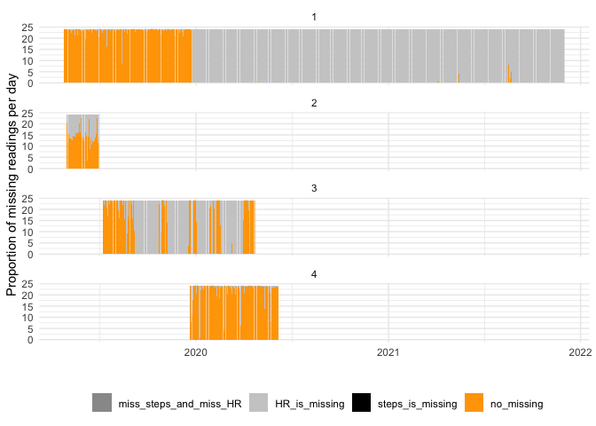
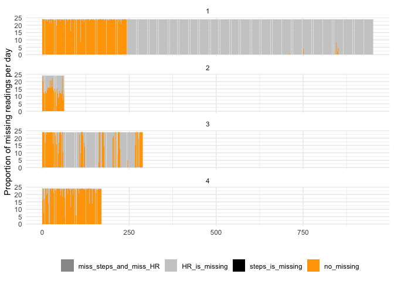
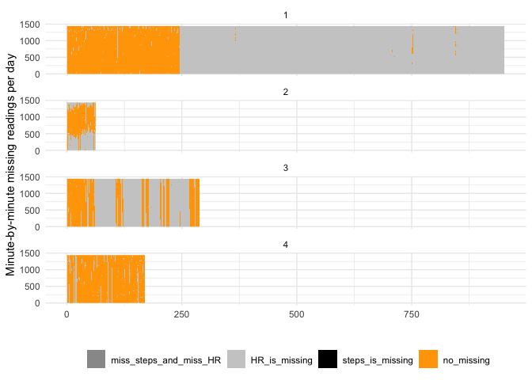

# plot_missingness


```r
library(tidyverse)
library(magrittr)
library(lubridate)
library(fitibble)
```


```r
minute_data <- read_rds("../../data/prep/minute_data__export_1.rds") %>% 
  fitibble()
```


```r
plot_missingness(minute_data)
```

<!-- -->


```r
plot_missingness(minute_data, calendar_time = F)
```

<!-- -->


```r
plot_missingness(minute_data, calendar_time = F, type = "raster")
```

<!-- -->
