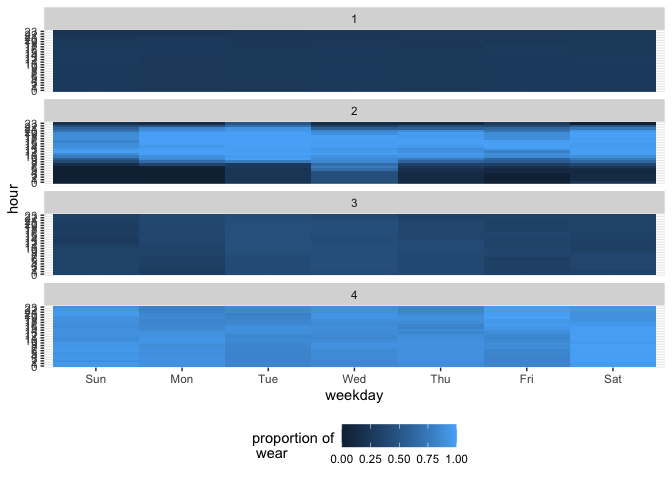
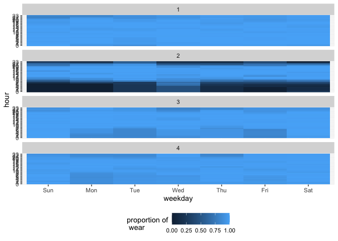
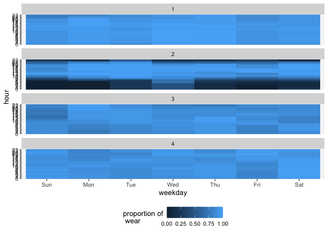

# plot_missingness


```r
library(tidyverse)
library(magrittr)
library(lubridate)
library(fitibble)
```


```r
minute_data <- read_rds("../../data/prep/minute_data__export_1.rds") %>% 
  fitibble()
```


```r
plot_wear_heatmap(minute_data)
```

```
## Joining, by = c("id", "hour", "weekday")
```

<!-- -->


```r
minute_data %>% 
  filter(is_valid_day) %>% 
  plot_wear_heatmap()
```

```
## Joining, by = c("id", "hour", "weekday")
```

<!-- -->

* try using all days that at least have 1 hour observation


```r
minute_data <- read_rds("../../data/prep/minute_data__export_1.rds") %>% 
  fitibble(adherent_args = list(hours_between = c(0,23)), 
           valid_day_args = list(minimum_adherent_hours = 1))
```


```r
minute_data %>% 
  filter(is_valid_day) %>% 
  plot_wear_heatmap()
```

```
## Joining, by = c("id", "hour", "weekday")
```

<!-- -->


