# summaries


```r
library(tidyverse)
library(magrittr)
library(lubridate)
#library(rapportools)
library(fitibble)

minute_data <- read_rds("../../data/prep/minute_data__export_1.rds") %>% 
  fitibble(nonwear_method = "choi_HR")
```


```r
prep_daily_data(minute_data)
```

```
## Joining, by = c("id", "date")
```

```
## # A tibble: 1,470 × 12
##       id date       valid_mins nonvalid_mins    HR zero_steps_prop steps sed_bout_length sedentary_time_use light_time_use
##    <int> <date>          <int>         <int> <dbl>           <dbl> <dbl>           <dbl>              <dbl>          <dbl>
##  1     1 2019-04-26        780             0  93.5           0.910  1885            15.4              0.891         0.109 
##  2     1 2019-04-27        780             0  82.4           0.897  2690            17.8              0.891         0.109 
##  3     1 2019-04-28        780             0  90.7           0.937  1590            24.7              0.918         0.0718
##  4     1 2019-04-29        780             0 108.            0.956  1590            20.6              0.871         0.105 
##  5     1 2019-04-30        780             0 101.            0.953  1763            38.7              0.942         0.0577
##  6     1 2019-05-01        780             0 104.            0.881  2914            15.0              0.867         0.133 
##  7     1 2019-05-02        780             0  96.8           0.840  4650            13.1              0.837         0.131 
##  8     1 2019-05-03        780             0  97.5           0.886  2210            14.4              0.883         0.117 
##  9     1 2019-05-04        780             0  97.4           0.883  4495            20.9              0.883         0.0795
## 10     1 2019-05-05        780             0  97.9           0.842  6257            16.4              0.840         0.104 
## # … with 1,460 more rows, and 2 more variables: moderate_time_use <dbl>, active_time_use <dbl>
```


```r
prep_daily_data(minute_data, nonvalid = T)
```

```
## Joining, by = c("id", "date")
```

```
## # A tibble: 1,470 × 12
##       id date       valid_mins nonvalid_mins    HR zero_steps_prop steps sed_bout_length sedentary_time_use light_time_use
##    <int> <date>          <int>         <int> <dbl>           <dbl> <dbl>           <dbl>              <dbl>          <dbl>
##  1     1 2019-04-26        780             0   NaN             NaN   NaN             NaN                 NA             NA
##  2     1 2019-04-27        780             0   NaN             NaN   NaN             NaN                 NA             NA
##  3     1 2019-04-28        780             0   NaN             NaN   NaN             NaN                 NA             NA
##  4     1 2019-04-29        780             0   NaN             NaN   NaN             NaN                 NA             NA
##  5     1 2019-04-30        780             0   NaN             NaN   NaN             NaN                 NA             NA
##  6     1 2019-05-01        780             0   NaN             NaN   NaN             NaN                 NA             NA
##  7     1 2019-05-02        780             0   NaN             NaN   NaN             NaN                 NA             NA
##  8     1 2019-05-03        780             0   NaN             NaN   NaN             NaN                 NA             NA
##  9     1 2019-05-04        780             0   NaN             NaN   NaN             NaN                 NA             NA
## 10     1 2019-05-05        780             0   NaN             NaN   NaN             NaN                 NA             NA
## # … with 1,460 more rows, and 2 more variables: moderate_time_use <dbl>, active_time_use <dbl>
```


```r
prep_daily_summary(minute_data)
```

```
## Joining, by = c("id", "date")
```

```
## # A tibble: 4 × 18
##      id valid_days mu_HR sd_HR mu_steps sd_steps mu_sed_bout_length sd_sed_bout_length mu_zero_steps_prop sd_zero_steps_prop
##   <int>      <int> <dbl> <dbl>    <dbl>    <dbl>              <dbl>              <dbl>              <dbl>              <dbl>
## 1     1        241  86.7  8.31    3051.    2458.              34.9              109.                0.880             0.0689
## 2     2         57  94.5  6.43    7223.    2885.               6.55               3.46              0.663             0.111 
## 3     3        102  95.5 11.2     4060.    2265.               8.89               5.96              0.766             0.101 
## 4     4        146 111.  10.9      162.     345.             141.               177.                0.988             0.0211
## # … with 8 more variables: mu_sedentary_time_use <dbl>, sd_sedentary_time_use <dbl>, mu_light_time_use <dbl>,
## #   sd_light_time_use <dbl>, mu_moderate_time_use <dbl>, sd_moderate_time_use <dbl>, mu_active_time_use <dbl>,
## #   sd_active_time_use <dbl>
```


```r
prep_daily_summary(minute_data, nonvalid = T)
```

```
## Joining, by = c("id", "date")
```

```
## # A tibble: 4 × 18
##      id valid_days mu_HR sd_HR mu_steps sd_steps mu_sed_bout_length sd_sed_bout_length mu_zero_steps_prop sd_zero_steps_prop
##   <int>      <int> <dbl> <dbl>    <dbl>    <dbl>              <dbl>              <dbl>              <dbl>              <dbl>
## 1     1        241  78.9  6.51     608.    1322.              45.6               48.9               0.956             0.0603
## 2     2         57  85.8  8.02    4170.    2910.               8.79               4.86              0.730             0.0720
## 3     3        102  89.7 15.5      924.     977.              15.6               13.6               0.850             0.130 
## 4     4        146 111.  11.3      177.     534.              96.1              123.                0.980             0.0313
## # … with 8 more variables: mu_sedentary_time_use <dbl>, sd_sedentary_time_use <dbl>, mu_light_time_use <dbl>,
## #   sd_light_time_use <dbl>, mu_moderate_time_use <dbl>, sd_moderate_time_use <dbl>, mu_active_time_use <dbl>,
## #   sd_active_time_use <dbl>
```


```r
fitibble:::prep_wear_summary(minute_data)
```

```
## # A tibble: 4 × 8
##      id min_date   max_date   total_hours wear_hours adherent_hours valid_hours nonvalid_hours
##   <int> <date>     <date>           <dbl>      <dbl>          <dbl>       <dbl>          <dbl>
## 1     1 2019-04-26 2021-12-01       22824      5839.          3183.       3111.           72.1
## 2     2 2019-04-30 2019-06-30        1488       937.           750.        710.           40.4
## 3     3 2019-07-09 2020-04-21        6912      2580.          1417.       1323.           94.0
## 4     4 2019-12-20 2020-06-05        4056      3706.          2018.       1887.          131.
```


```r
fitibble:::prep_valid_wear_summary(minute_data)
```

```
## Joining, by = "id"
```

```
## # A tibble: 4 × 12
##      id min_HR__VWT max_HR__VWT mean_HR__VWT sd_HR__VWT max_pos_steps__V… mean_pos_steps_… zero_steps_prop… sedentary_prop_…
##   <int>       <dbl>       <dbl>        <dbl>      <dbl>             <dbl>            <dbl>            <dbl>            <dbl>
## 1     1          52         203         86.7       15.6               159             32.9            0.880            0.856
## 2     2          63         178         94.6       12.2               142             28.6            0.662            0.638
## 3     3          47         176         95.5       17.9               129             22.3            0.766            0.652
## 4     4          61         170        111.        14.2               118             17.2            0.988            0.956
## # … with 3 more variables: light_prop__VWT <dbl>, moderate_prop__VWT <dbl>, active_prop__VWT <dbl>
```


```r
fitibble:::prep_nonvalid_wear_summary(minute_data)
```

```
## Joining, by = "id"
```

```
## # A tibble: 4 × 12
##      id min_HR__NVW max_HR__NVW mean_HR__NVW sd_HR__NVW max_pos_steps__N… mean_pos_steps_… zero_steps_prop… sedentary_prop_…
##   <int>       <dbl>       <dbl>        <dbl>      <dbl>             <dbl>            <dbl>            <dbl>            <dbl>
## 1     1          58         202         80.7       15.4               112             31.0            0.932            0.920
## 2     2          64         136         87.5       13.1               108             30.6            0.719            0.707
## 3     3          46         177         94.3       20.6                88             20.7            0.826            0.708
## 4     4          64         163        112.        14.9               114             26.2            0.983            0.958
## # … with 3 more variables: light_prop__NVW <dbl>, moderate_prop__NVW <dbl>, active_prop__NVW <dbl>
```


```r
prep_patient_summary(minute_data)
```

```
## Joining, by = "id"
## Joining, by = "id"
## Joining, by = "id"
## Joining, by = "id"
```

```
## # A tibble: 4 × 30
##      id min_date   max_date   total_hours wear_hours adherent_hours valid_hours nonvalid_hours min_HR__VWT max_HR__VWT
##   <int> <date>     <date>           <dbl>      <dbl>          <dbl>       <dbl>          <dbl>       <dbl>       <dbl>
## 1     1 2019-04-26 2021-12-01       22824      5839.          3183.       3111.           72.1          52         203
## 2     2 2019-04-30 2019-06-30        1488       937.           750.        710.           40.4          63         178
## 3     3 2019-07-09 2020-04-21        6912      2580.          1417.       1323.           94.0          47         176
## 4     4 2019-12-20 2020-06-05        4056      3706.          2018.       1887.          131.           61         170
## # … with 20 more variables: mean_HR__VWT <dbl>, sd_HR__VWT <dbl>, max_pos_steps__VWT <dbl>, mean_pos_steps__VWT <dbl>,
## #   zero_steps_prop__VWT <dbl>, sedentary_prop__VWT <dbl>, light_prop__VWT <dbl>, moderate_prop__VWT <dbl>,
## #   active_prop__VWT <dbl>, min_HR__NVW <dbl>, max_HR__NVW <dbl>, mean_HR__NVW <dbl>, sd_HR__NVW <dbl>,
## #   max_pos_steps__NVW <dbl>, mean_pos_steps__NVW <dbl>, zero_steps_prop__NVW <dbl>, sedentary_prop__NVW <dbl>,
## #   light_prop__NVW <dbl>, moderate_prop__NVW <dbl>, active_prop__NVW <dbl>
```


```r
prep_daily_summary(minute_data) %>% 
  fitibble:::plot_confidence_intervals(mu_varname = "mu_HR", 
                            sd_varname = "sd_HR")
```

```
## Joining, by = c("id", "date")
```

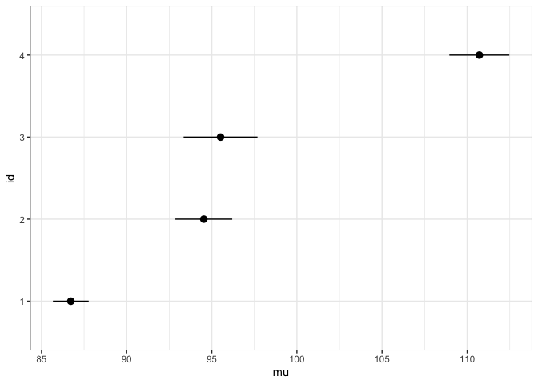<!-- -->

```r
prep_daily_summary(minute_data) %>% 
  fitibble:::plot_confidence_intervals(mu_varname = "mu_steps", 
                            sd_varname = "sd_steps")
```

```
## Joining, by = c("id", "date")
```

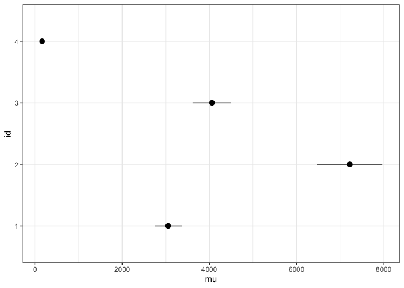<!-- -->


```r
prep_daily_summary(minute_data) %>% 
  fitibble:::plot_confidence_intervals(mu_varname = "mu_zero_steps_prop", 
                            sd_varname = "sd_zero_steps_prop")
```

```
## Joining, by = c("id", "date")
```

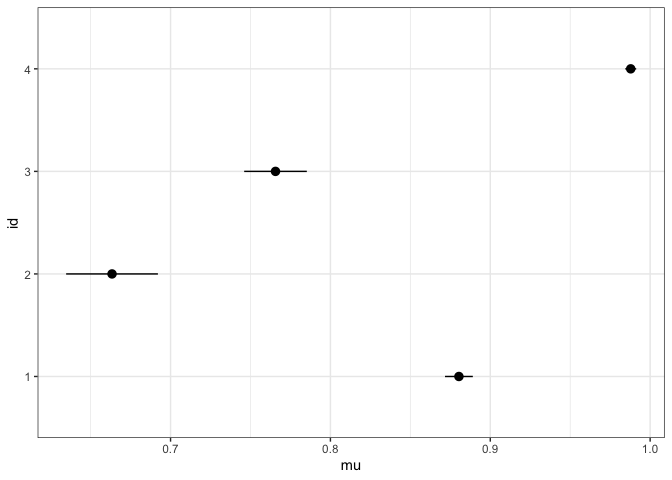<!-- -->

```r
prep_daily_summary(minute_data) %>% 
  fitibble:::plot_confidence_intervals(mu_varname = "mu_zero_steps_prop", 
                            sd_varname = "sd_zero_steps_time_prop", 
                            type = "categorical")
```

```
## Joining, by = c("id", "date")
```

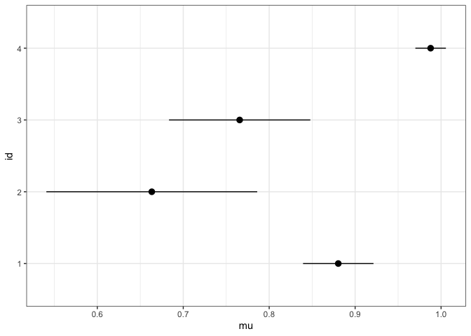<!-- -->


```r
daily_summary <- prep_daily_summary(minute_data)
```

```
## Joining, by = c("id", "date")
```

```r
daily_summary %>% 
  fitibble:::plot_confidence_intervals(mu_varname = "mu_sedentary_time_use", 
                            sd_varname = "sd_sedentary_time_use", 
                            type = "categorical")
```

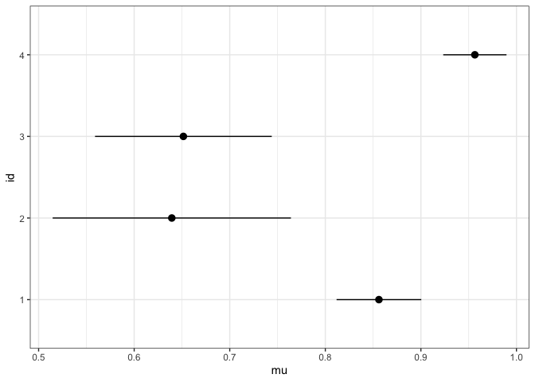<!-- -->

```r
daily_summary %>% 
  fitibble:::plot_confidence_intervals(mu_varname = "mu_light_time_use", 
                            sd_varname = "sd_light_time_use", 
                            type = "categorical")
```

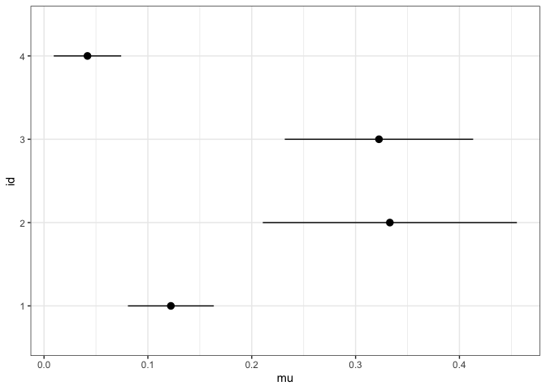<!-- -->

```r
daily_summary %>% 
  fitibble:::plot_confidence_intervals(mu_varname = "mu_moderate_time_use", 
                            sd_varname = "sd_moderate_time_use", 
                            type = "categorical")
```

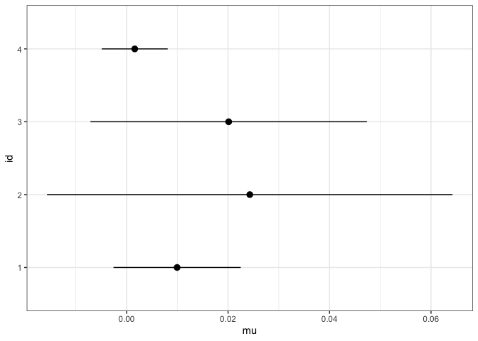<!-- -->

```r
daily_summary %>% 
  fitibble:::plot_confidence_intervals(mu_varname = "mu_active_time_use", 
                            sd_varname = "sd_active_time_use", 
                            type = "categorical")
```

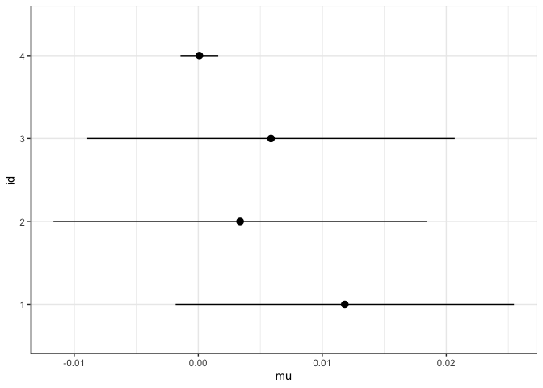<!-- -->


```r
daily_summary %>% 
  plot_ci()
```

```
## Joining, by = c("id", "valid_days", "name")
```

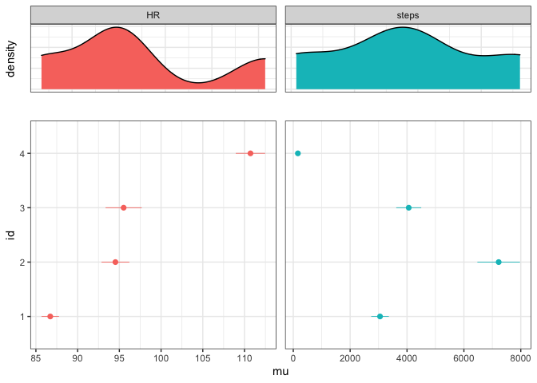<!-- -->

```r
daily_summary %>% 
  plot_ci(critical_value = qt(p=.05/2, df=4, lower.tail=FALSE))
```

```
## Joining, by = c("id", "valid_days", "name")
```

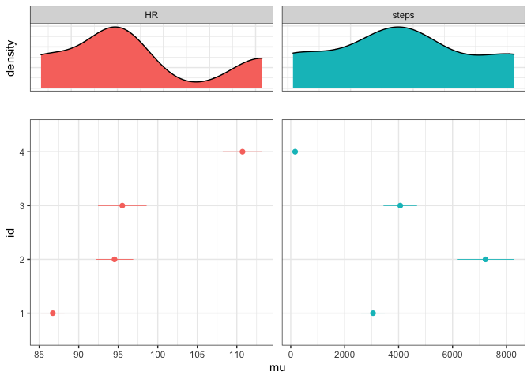<!-- -->


```r
daily_summary %>% 
  plot_ci(type = "sedentary_behavior")
```

```
## Joining, by = c("id", "valid_days", "name")
```

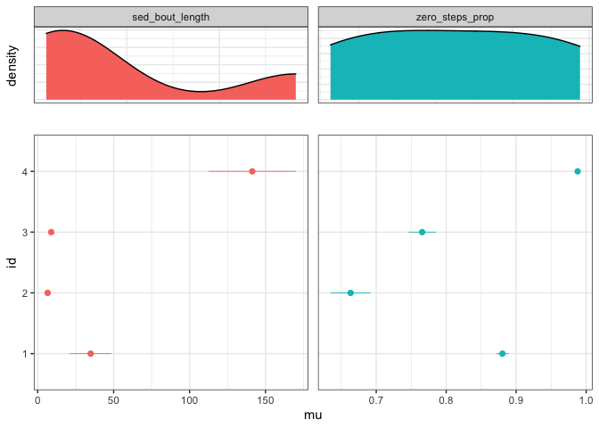<!-- -->


```r
daily_summary %>% 
  plot_ci(type = "time_use")
```

```
## Joining, by = c("id", "valid_days", "name")
```

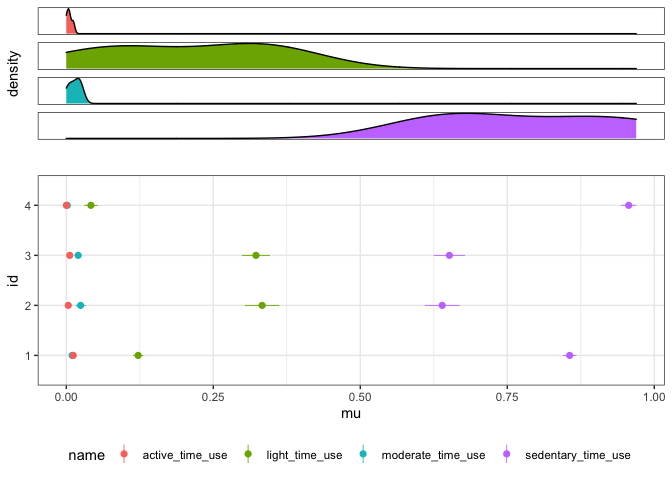<!-- -->

