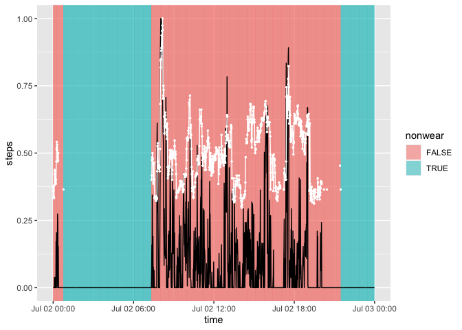
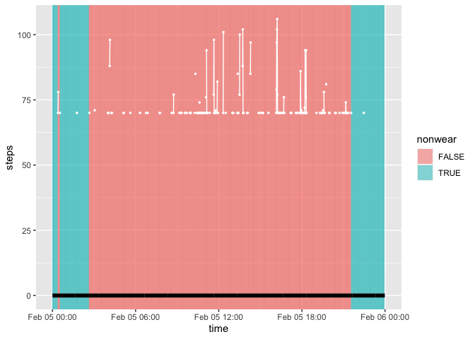
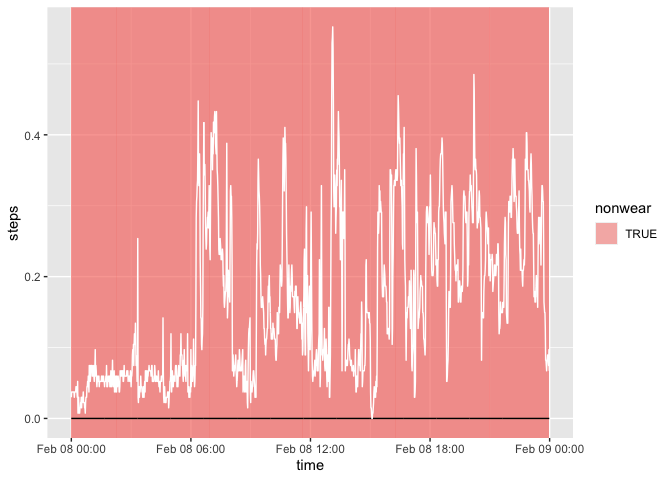
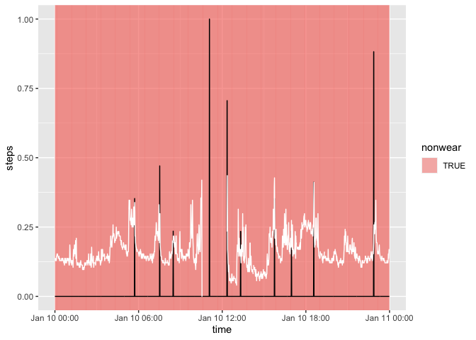
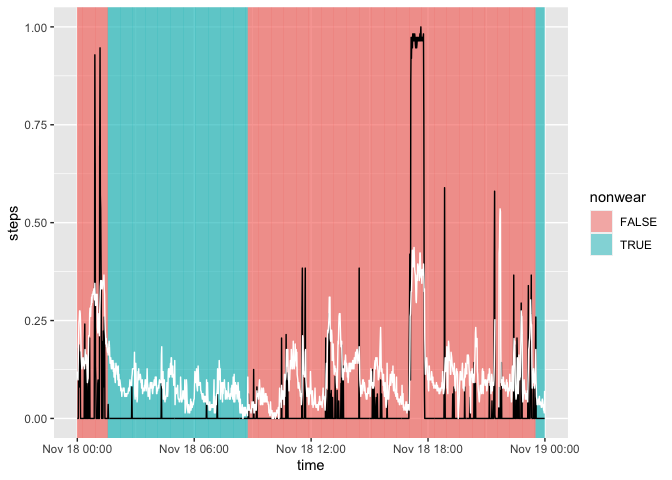
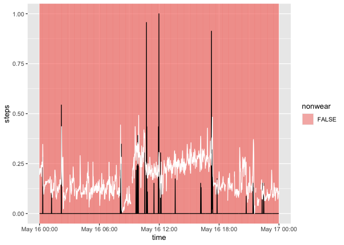

# flag_nonwear


```r
library(tidyverse)
library(magrittr)
library(fitibble)
```


```r
minute_data <- readRDS("../../data/prep/minute_data__export_2.rds")
```

## choi HR


```r
#apply flag_choi directly to missing HR
minute_data %<>% 
  group_by(id) %>% 
  mutate(nonwear = flag_choi(1 - is.na(HR))) %>% 
  ungroup()

minute_data %>% 
  group_by(id) %>% 
  summarise(
    n = n(), 
    is_zero_steps = sum(steps == 0, na.rm = T), 
    nonwear = sum(nonwear), 
    is_na_HR = sum(is.na(HR))
  )
```

```
## # A tibble: 46 × 5
##       id       n is_zero_steps nonwear is_na_HR
##    <int>   <int>         <int>   <int>    <int>
##  1     1  874080        821375  405256   412458
##  2     2  717120        711193  620595   631599
##  3     3   11520         10211    2474     3339
##  4     4  872640        824948  378708   397791
##  5     5 1369440       1335428 1019088  1024505
##  6     6   89280         71334   33054    34846
##  7     8  161280        144058   49589    50772
##  8     9  414720        388950  259918   261716
##  9    10  485280        425427  198735   205674
## 10    11  619200        565770  378259   396505
## # … with 36 more rows
```


```r
# #choose example
# minute_data %>% 
#   mutate(date = as.Date(time)) %>% 
#   group_by(id, date) %>% 
#   summarise(
#     diff = sum(is.na(HR)) - sum(nonwear), 
#     steps_na_hr = sum(is.na(HR) & steps)
#     ) %>% 
#   arrange(desc(diff)) %>% View()

minute_data %>% 
  mutate(date = as.Date(time)) %>% 
  filter(id == 10, date == as.Date("2020-07-02")) %>%
  mutate(
    xmin = time, 
    xmax = lag(time), 
    nonwear = as.factor(nonwear), 
    steps = (steps - min(0, steps)) / max(1, steps), 
    HR = (HR - min(0, HR, na.rm = T)) / max(1, HR, na.rm = T)
    ) %>% 
  select(time, xmin, xmax, nonwear, steps, HR)  %>% 
  ggplot() + 
  geom_rect(aes(xmin=xmin, xmax=xmax, ymin=-Inf, ymax=Inf, fill=nonwear), alpha = 0.5) + 
  geom_line(aes(x = time, y = steps)) + 
  geom_point(aes(x = time, y = HR), color = "white", size = 0.5) + 
  geom_line(aes(x = time, y = HR), color = "white")
```

```
## Warning: Removed 1 rows containing missing values (geom_rect).
```

```
## Warning: Removed 696 rows containing missing values (geom_point).
```

```
## Warning: Removed 151 row(s) containing missing values (geom_path).
```

<!-- -->


```r
#apply flag_choi_HR

minute_data %<>% 
  group_by(id) %>% 
  mutate(nonwear = flag_choi_HR(HR)) %>% 
  ungroup()

minute_data %>% 
  group_by(id) %>% 
  summarise(
    n = n(), 
    is_zero_steps = sum(steps == 0, na.rm = T), 
    nonwear = sum(nonwear), 
    is_na_HR = sum(is.na(HR))
  )
```

```
## # A tibble: 46 × 5
##       id       n is_zero_steps nonwear is_na_HR
##    <int>   <int>         <int>   <int>    <int>
##  1     1  874080        821375  405256   412458
##  2     2  717120        711193  620595   631599
##  3     3   11520         10211    2474     3339
##  4     4  872640        824948  378708   397791
##  5     5 1369440       1335428 1019088  1024505
##  6     6   89280         71334   33054    34846
##  7     8  161280        144058   49589    50772
##  8     9  414720        388950  259918   261716
##  9    10  485280        425427  198735   205674
## 10    11  619200        565770  378259   396505
## # … with 36 more rows
```


```r
minute_data %>% 
  mutate(date = as.Date(time)) %>% 
  filter(id == 45, date == as.Date("2022-02-05")) %>% 
  mutate(
    xmin = time, 
    xmax = lag(time), 
    nonwear = as.factor(nonwear)
    ) %>% 
  select(time, xmin, xmax, nonwear, steps, HR)  %>% 
  ggplot() + 
  geom_rect(aes(xmin=xmin, xmax=xmax, ymin=-Inf, ymax=Inf, fill=nonwear), alpha = 0.5) + 
  geom_line(aes(x = time, y = steps), size = 2) +
  geom_point(aes(x = time, y = HR), color = "white", size = 0.5) + 
  geom_line(aes(x = time, y = HR), color = "white")
```

```
## Warning: Removed 1 rows containing missing values (geom_rect).
```

```
## Warning: Removed 1288 rows containing missing values (geom_point).
```

```
## Warning: Removed 115 row(s) containing missing values (geom_path).
```

<!-- -->

## choi steps


```r
#apply flag_choi_steps 
minute_data %<>% 
  group_by(id) %>% 
  mutate(nonwear = flag_choi_steps(steps)) %>% 
  ungroup()

minute_data %>% 
  group_by(id) %>% 
  summarise(
    n = n(), 
    is_zero_steps = sum(steps == 0, na.rm = T), 
    nonwear = sum(nonwear), 
    is_na_HR = sum(is.na(HR))
  )
```

```
## # A tibble: 46 × 5
##       id       n is_zero_steps nonwear is_na_HR
##    <int>   <int>         <int>   <int>    <int>
##  1     1  874080        821375  666906   412458
##  2     2  717120        711193  681910   631599
##  3     3   11520         10211    6336     3339
##  4     4  872640        824948  669211   397791
##  5     5 1369440       1335428 1181120  1024505
##  6     6   89280         71334   39458    34846
##  7     8  161280        144058  102506    50772
##  8     9  414720        388950  317962   261716
##  9    10  485280        425427  289749   205674
## 10    11  619200        565770  418225   396505
## # … with 36 more rows
```


```r
# #choose example
# minute_data %>% 
#   mutate(date = as.Date(time)) %>% 
#   group_by(id, date) %>% 
#   summarise(diff = sum(nonwear) - sum(is.na(HR))) %>% 
#   arrange(desc(diff)) %>% View()

minute_data %>% 
  mutate(date = as.Date(time)) %>% 
  filter(id == 1, date == as.Date("2019-02-08")) %>% 
  mutate(
    xmin = time, 
    xmax = lag(time), 
    nonwear = as.factor(nonwear), 
    steps = (steps - min(0, steps)) / max(1, steps), 
    HR = (HR - min(HR, na.rm = T)) / max(HR, na.rm = T)
    ) %>% 
  select(time, xmin, xmax, nonwear, steps, HR)  %>% 
  ggplot() + 
  geom_rect(aes(xmin=xmin, xmax=xmax, ymin=-Inf, ymax=Inf, fill=nonwear), alpha = 0.5) + 
  geom_line(aes(x = time, y = steps)) + 
  geom_line(aes(x = time, y = HR), color = "white")
```

```
## Warning: Removed 1 rows containing missing values (geom_rect).
```

<!-- -->


```r
#choose example
# minute_data %>% 
#   mutate(date = as.Date(time)) %>% 
#   group_by(id, date) %>% 
#   summarise(diff = sum(nonwear) - sum(steps == 0)) %>% 
#   arrange(diff) %>%  View()

minute_data %>% 
  mutate(date = as.Date(time)) %>% 
  filter(id == 12, date == as.Date("2020-01-10")) %>% 
  mutate(
    xmin = time, 
    xmax = lag(time), 
    nonwear = as.factor(nonwear), 
    is_na_hr = as.factor(is.na(HR)),
    steps = (steps - min(steps)) / max(steps), 
    HR = (HR - min(HR, na.rm = T)) / max(HR, na.rm = T)
    ) %>% 
  select(time, xmin, xmax, nonwear, is_na_hr, steps, HR)  %>% 
  ggplot() + 
  geom_rect(aes(xmin=xmin, xmax=xmax, ymin=-Inf, ymax=Inf, fill=nonwear), alpha = 0.5) +  
  geom_line(aes(x = time, y = steps)) + 
  geom_line(aes(x = time, y = HR), color = "white")
```

```
## Warning: Removed 1 rows containing missing values (geom_rect).
```

<!-- -->


```r
minute_data %>% 
  mutate(date = as.Date(time)) %>% 
  filter(id == 5, date == as.Date("2019-11-18")) %>% 
  mutate(
    xmin = time, 
    xmax = lag(time), 
    nonwear = as.factor(nonwear), 
    steps = (steps - min(steps)) / max(steps), 
    HR = (HR - min(HR, na.rm = T)) / max(HR, na.rm = T)
    ) %>% 
  select(time, xmin, xmax, nonwear, steps, HR)  %>% 
  ggplot() + 
  geom_rect(aes(xmin=xmin, xmax=xmax, ymin=-Inf, ymax=Inf, fill=nonwear), alpha = 0.5) + 
  geom_line(aes(x = time, y = steps)) + 
  geom_line(aes(x = time, y = HR), color = "white")
```

```
## Warning: Removed 1 rows containing missing values (geom_rect).
```

<!-- -->

## comparison


```r
minute_data %<>% 
  select(-nonwear) %>% 
  group_by(id) %>% 
  mutate(
    nonwear_missing_HR = flag_nonwear(HR, steps, nonwear_method = "missing_HR"), 
    nonwear_missing_HR_zero_steps = flag_nonwear(HR, steps, nonwear_method = "missing_HR_zero_steps"), 
    nonwear_choi_HR = flag_nonwear(HR, steps, nonwear_method = "choi_HR"),
    nonwear_choi_steps = flag_nonwear(HR, steps, nonwear_method = "choi_steps")
    )
```


```r
minute_data %>% 
  group_by(id) %>% 
  summarise(
    across(contains("nonwear"), sum)
  ) %>% 
  rename_with(~gsub("nonwear_", "", .x), .cols = contains("nonwear")) %>% 
  mutate(ratio = missing_HR / choi_HR) %>% 
  arrange(desc(ratio))
```

```
## # A tibble: 46 × 6
##       id missing_HR missing_HR_zero_steps choi_HR choi_steps  ratio
##    <int>      <int>                 <int>   <int>      <int>  <dbl>
##  1    33        134                   134       0      18417 Inf   
##  2    46         11                    11       0       1488 Inf   
##  3    16       4353                  4334    1758      87913   2.48
##  4    44        533                   527     369       8737   1.44
##  5    43       4439                  4363    3082      24837   1.44
##  6     3       3339                  3339    2474       6336   1.35
##  7    45      26012                 26009   19641      27439   1.32
##  8    41       1026                  1026     793      13959   1.29
##  9    15       3726                  3726    2887       3986   1.29
## 10    40      54345                 53979   43293     182539   1.26
## # … with 36 more rows
```


```r
minute_data %>% 
  rename_with(~gsub("nonwear_", "", .x), .cols = contains("nonwear")) %>% 
  mutate(date = as.Date(time)) %>% 
  filter(id == 16) %>% 
  group_by(date) %>% 
  summarise(diff = sum(missing_HR) - sum(choi_HR)) %>% 
  arrange(desc(diff))
```

```
## # A tibble: 94 × 2
##    date        diff
##    <date>     <int>
##  1 2020-06-19   144
##  2 2020-04-14   118
##  3 2020-04-03    94
##  4 2020-04-27    86
##  5 2020-04-30    84
##  6 2020-05-21    79
##  7 2020-06-09    79
##  8 2020-03-20    73
##  9 2020-04-13    73
## 10 2020-05-16    72
## # … with 84 more rows
```


```r
minute_data %>% 
  mutate(date = as.Date(time)) %>% 
  rename_with(~gsub("nonwear_", "", .x), .cols = contains("nonwear")) %>% 
  filter(id == 16, date == as.Date("2020-05-16")) %>% 
  mutate(
    xmin = time, 
    xmax = lag(time), 
    nonwear = as.factor(choi_HR), 
    steps = (steps - min(steps)) / max(steps), 
    HR = (HR - min(HR, na.rm = T)) / max(HR, na.rm = T)
    ) %>% 
  select(time, xmin, xmax, nonwear, steps, HR)  %>% 
  ggplot() + 
  geom_rect(aes(xmin=xmin, xmax=xmax, ymin=-Inf, ymax=Inf, fill=nonwear), alpha = 0.5) + 
  geom_line(aes(x = time, y = steps)) + 
  geom_line(aes(x = time, y = HR), color = "white")
```

```
## Adding missing grouping variables: `id`
```

```
## Warning: Removed 1 rows containing missing values (geom_rect).
```

<!-- -->

* total number of nonwear entries flagged by each method 

Applying choi algorithm to steps appears to be pretty problematic in the case of sedentary subjects. The total number of nonwear entries is much higher than it should be.


```r
minute_data <- readRDS("../../data/prep/minute_data__export_2.rds") %>%  
  group_by(id) %>% 
  mutate(
    nonwear_missing_HR = flag_nonwear(HR, steps, nonwear_method = "missing_HR"), 
    nonwear_missing_HR_zero_steps = flag_nonwear(HR, steps, nonwear_method = "missing_HR_zero_steps"), 
    nonwear_choi_HR = flag_nonwear(HR, steps, nonwear_method = "choi_HR"),
    nonwear_choi_steps = flag_nonwear(HR, steps, nonwear_method = "choi_steps")
    )

minute_data %>% 
  group_by(id) %>% 
  summarise(
    across(contains("nonwear"), sum)
  ) %>% 
  rename_with(~gsub("nonwear_", "", .x), .cols = contains("nonwear"))
```

```
## # A tibble: 46 × 5
##       id missing_HR missing_HR_zero_steps choi_HR choi_steps
##    <int>      <int>                 <int>   <int>      <int>
##  1     1     412458                410938  405256     666906
##  2     2     631599                631597  620595     681910
##  3     3       3339                  3339    2474       6336
##  4     4     397791                395528  378708     669211
##  5     5    1024505               1024469 1019088    1181120
##  6     6      34846                 34051   33054      39458
##  7     8      50772                 50763   49589     102506
##  8     9     261716                259041  259918     317962
##  9    10     205674                203442  198735     289749
## 10    11     396505                395630  378259     418225
## # … with 36 more rows
```

* mean daily nonwear per method


```r
minute_data %>% 
  mutate(date = as.Date(time)) %>% 
  group_by(id, date) %>% 
  summarise(across(contains("nonwear"), sum)) %>% 
  group_by(id) %>% 
  summarise(
    across(
      contains("nonwear"), 
      list(mean = ~ mean(.x)), 
      "{.col}_{.fn}"
      )
    ) %>% 
  rename_with(~gsub("nonwear_", "", .x), .cols = contains("nonwear"))
```

```
## `summarise()` has grouped output by 'id'. You can override using the `.groups` argument.
```

```
## # A tibble: 46 × 5
##       id missing_HR_mean missing_HR_zero_steps_mean choi_HR_mean choi_steps_mean
##    <int>           <dbl>                      <dbl>        <dbl>           <dbl>
##  1     1            680.                       677.         668.           1099.
##  2     2           1268.                      1268.        1246.           1369.
##  3     3            417.                       417.         309.            792 
##  4     4            656.                       653.         625.           1104.
##  5     5           1077.                      1077.        1072.           1242.
##  6     6            562.                       549.         533.            636.
##  7     8            453.                       453.         443.            915.
##  8     9            909.                       899.         902.           1104.
##  9    10            610.                       604.         590.            860.
## 10    11            922.                       920.         880.            973.
## # … with 36 more rows
```

```r
minute_data %>% 
  mutate(date = as.Date(time)) %>% 
  group_by(id, date) %>% 
  summarise(across(contains("nonwear"), sum)) %>% 
  group_by(id) %>% 
  summarise(
    across(
      contains("nonwear"), 
      list(q50 = ~ quantile(.x, 0.50)), 
      "{.col}_{.fn}"
      )
    ) %>% 
  rename_with(~gsub("nonwear_", "", .x), .cols = contains("nonwear"))
```

```
## `summarise()` has grouped output by 'id'. You can override using the `.groups` argument.
```

```
## # A tibble: 46 × 5
##       id missing_HR_q50 missing_HR_zero_steps_q50 choi_HR_q50 choi_steps_q50
##    <int>          <dbl>                     <dbl>       <dbl>          <dbl>
##  1     1            445                      444         444           1440 
##  2     2           1440                     1440        1440           1440 
##  3     3            473                      473         364.           752 
##  4     4            655                      648.        600.          1111 
##  5     5           1440                     1440        1440           1440 
##  6     6            594                      578.        563            610 
##  7     8            199                      199         164.           858.
##  8     9           1440                     1440        1440           1440 
##  9    10            278                      278         252            688 
## 10    11            811                      810.        762            852.
## # … with 36 more rows
```

```r
minute_data %>% 
  mutate(date = as.Date(time)) %>% 
  group_by(id, date) %>% 
  summarise(across(contains("nonwear"), sum)) %>% 
  group_by(id) %>% 
  summarise(
    across(
      contains("nonwear"), 
      list(q25 = ~ quantile(.x, 0.25)), 
      "{.col}_{.fn}"
      )
    ) %>% 
  rename_with(~gsub("nonwear_", "", .x), .cols = contains("nonwear"))
```

```
## `summarise()` has grouped output by 'id'. You can override using the `.groups` argument.
```

```
## # A tibble: 46 × 5
##       id missing_HR_q25 missing_HR_zero_steps_q25 choi_HR_q25 choi_steps_q25
##    <int>          <dbl>                     <dbl>       <dbl>          <dbl>
##  1     1           17                        17           0             605 
##  2     2         1440                      1440        1440            1440 
##  3     3          188.                      188.         21.8           654.
##  4     4           27.2                      27.2         0             819 
##  5     5          198.                      198.        171            1210.
##  6     6          488.                      483.        466             535 
##  7     8            4                         4           0             674.
##  8     9           10.8                      10.8         0             666.
##  9    10           14                        12           0             502 
## 10    11          660.                      660.        621.            688.
## # … with 36 more rows
```

```r
minute_data %>% 
  mutate(date = as.Date(time)) %>% 
  group_by(id, date) %>% 
  summarise(across(contains("nonwear"), sum)) %>% 
  group_by(id) %>% 
  summarise(
    across(
      contains("nonwear"), 
      list(q75 = ~ quantile(.x, 0.75)), 
      "{.col}_{.fn}"
      )
    ) %>% 
  rename_with(~gsub("nonwear_", "", .x), .cols = contains("nonwear"))
```

```
## `summarise()` has grouped output by 'id'. You can override using the `.groups` argument.
```

```
## # A tibble: 46 × 5
##       id missing_HR_q75 missing_HR_zero_steps_q75 choi_HR_q75 choi_steps_q75
##    <int>          <dbl>                     <dbl>       <dbl>          <dbl>
##  1     1          1440                      1440        1440           1440 
##  2     2          1440                      1440        1440           1440 
##  3     3           645.                      645.        509.           821 
##  4     4          1322.                     1322.       1307           1440 
##  5     5          1440                      1440        1440           1440 
##  6     6           694                       679         660.           708.
##  7     8           825.                      825.        755.          1109.
##  8     9          1440                      1440        1440           1440 
##  9    10          1440                      1440        1440           1440 
## 10    11          1416                      1416.       1288.          1440 
## # … with 36 more rows
```

