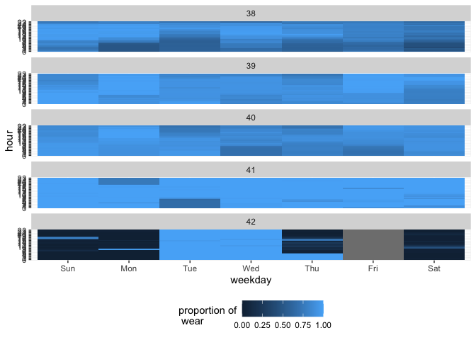

# plot_wear_heatmap


```r
library(tidyverse)
```

```
## ── Attaching packages ─────────────────────────────────────────────────────────────────────────────────── tidyverse 1.3.1 ──
```

```
## ✓ ggplot2 3.3.5     ✓ purrr   0.3.4
## ✓ tibble  3.1.6     ✓ dplyr   1.0.8
## ✓ tidyr   1.2.0     ✓ stringr 1.4.1
## ✓ readr   2.1.2     ✓ forcats 0.5.1
```

```
## ── Conflicts ────────────────────────────────────────────────────────────────────────────────────── tidyverse_conflicts() ──
## x dplyr::filter() masks stats::filter()
## x dplyr::lag()    masks stats::lag()
```

```r
library(magrittr)
```

```
## 
## Attaching package: 'magrittr'
```

```
## The following object is masked from 'package:purrr':
## 
##     set_names
```

```
## The following object is masked from 'package:tidyr':
## 
##     extract
```

```r
library(lubridate)
```

```
## 
## Attaching package: 'lubridate'
```

```
## The following objects are masked from 'package:base':
## 
##     date, intersect, setdiff, union
```

```r
library(fitibble)
```


```r
minute_data <- read_rds("../../data/prep/minute_data__export_2.rds") %>% 
  fitibble(adherent_args = list(hours_between = c(0,23)), 
           valid_day_args = list(minimum_adherent_hours = 1))
```


```r
n <- 10
id_ <- unique(minute_data$id)
index <- round(seq(0, length(id_), length.out = n))
p <- list()
for(i in 1:(n - 1)) {
  p[[i]] <- minute_data %>% 
    filter(id %in% id_[(index[i] + 1):index[i + 1]]) %>% 
    filter(is_valid_day) %>% 
    plot_wear_heatmap()
}
```

```
## Joining, by = c("id", "hour", "weekday")
## Joining, by = c("id", "hour", "weekday")
## Joining, by = c("id", "hour", "weekday")
## Joining, by = c("id", "hour", "weekday")
## Joining, by = c("id", "hour", "weekday")
## Joining, by = c("id", "hour", "weekday")
## Joining, by = c("id", "hour", "weekday")
## Joining, by = c("id", "hour", "weekday")
## Joining, by = c("id", "hour", "weekday")
```

```r
p
```

```
## [[1]]
```

<!-- -->

```
## 
## [[2]]
```

<!-- -->

```
## 
## [[3]]
```

<!-- -->

```
## 
## [[4]]
```

<!-- -->

```
## 
## [[5]]
```

<!-- -->

```
## 
## [[6]]
```

<!-- -->

```
## 
## [[7]]
```

<!-- -->

```
## 
## [[8]]
```

<!-- -->

```
## 
## [[9]]
```

<!-- -->
