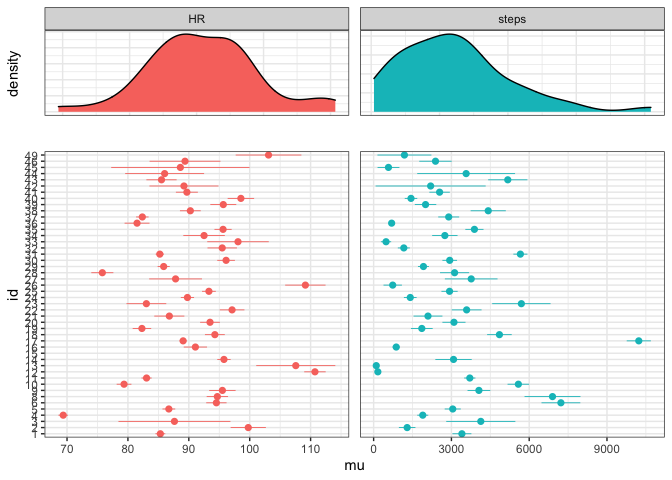
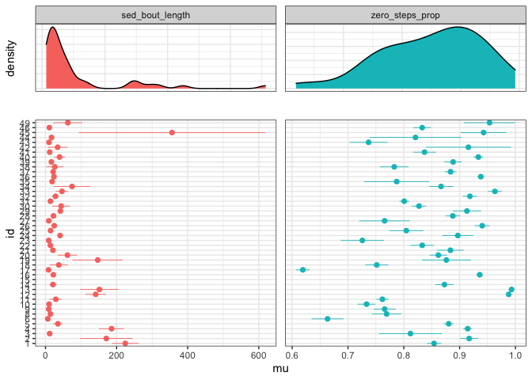
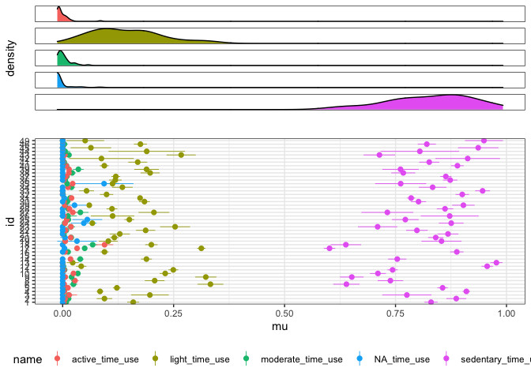

# summaries


```r
library(tidyverse)
library(magrittr)
library(lubridate)
library(fitibble)

minute_data <- read_rds("../../data/prep/minute_data__export_2.rds") %>% 
  fitibble(nonwear_method = "choi_HR")
```


```r
prep_daily_data(minute_data)
```

```
## Joining, by = c("id", "date")
```

```
## # A tibble: 10,766 × 13
##       id date       valid_mins nonvalid_mins    HR zero_steps_prop steps sed_bout_length sedentary_time_use light_time_use
##    <int> <date>          <int>         <int> <dbl>           <dbl> <dbl>           <dbl>              <dbl>          <dbl>
##  1     1 2019-01-26        780             0  84.2           0.612  9493            6.90              0.601          0.365
##  2     1 2019-01-27        712             0  89.1           0.566 11432            5.63              0.538          0.347
##  3     1 2019-01-28        780             0  80.6           0.876  3241           16.8               0.864          0.124
##  4     1 2019-01-29        780             0  83.3           0.801  4883           12.6               0.759          0.209
##  5     1 2019-01-30        780             0  88.2           0.842  3619           13.2               0.797          0.203
##  6     1 2019-01-31        780             0  98.4           0.901  1850           11.5               0.736          0.264
##  7     1 2019-02-01        780             0  99.2           0.909  1810            4.79              0.429          0.571
##  8     1 2019-02-02        780             0  92.3           0.878  2526           11                 0.776          0.224
##  9     1 2019-02-03        780             0  89.3           0.849  3014           13.6               0.819          0.181
## 10     1 2019-02-04        762             0  86.2           0.799  5496           10.8               0.778          0.222
## # … with 10,756 more rows, and 3 more variables: moderate_time_use <dbl>, active_time_use <dbl>, NA_time_use <dbl>
```


```r
fitibble:::prep_wear_summary(minute_data)
```

```
## # A tibble: 46 × 8
##       id min_date   max_date   total_hours wear_hours adherent_hours valid_hours nonvalid_hours
##    <int> <date>     <date>           <dbl>      <dbl>          <dbl>       <dbl>          <dbl>
##  1     1 2019-01-26 2020-09-23       14568      7814.         4338.       4093.           245. 
##  2     2 2019-02-02 2020-06-13       11952      1609.         1035.        789.           245. 
##  3     3 2019-03-05 2019-03-12         192       151.           91.0        86.8            4.1
##  4     4 2019-03-12 2020-11-06       14544      8232.         4592.       3573.          1020. 
##  5     5 2019-04-26 2021-12-01       22824      5839.         3183.       3111.            72.1
##  6     6 2019-04-30 2019-06-30        1488       937.          750.        710.            40.4
##  7     8 2019-05-31 2019-09-19        2688      1862.         1039.        923.           116. 
##  8     9 2019-07-09 2020-04-21        6912      2580.         1417.       1323.            94.0
##  9    10 2019-11-13 2020-10-14        8088      4776.         2671.       2432.           239. 
## 10    11 2020-01-03 2021-03-07       10320      4016.         3401.       2562.           839. 
## # … with 36 more rows
```


```r
fitibble:::prep_valid_wear_summary(minute_data)
```

```
## Warning in min(.data$HR, na.rm = T): no non-missing arguments to min; returning Inf
```

```
## Warning in max(.data$HR, na.rm = T): no non-missing arguments to max; returning -Inf
```

```
## Warning in max(.data$pos_steps, na.rm = T): no non-missing arguments to max; returning -Inf
```

```
## Joining, by = "id"
```

```
## # A tibble: 46 × 13
##       id min_HR__VWT max_HR__VWT mean_HR__VWT sd_HR__VWT max_pos_steps__… mean_pos_steps_… zero_steps_prop… sedentary_prop_…
##    <int>       <dbl>       <dbl>        <dbl>      <dbl>            <dbl>            <dbl>            <dbl>            <dbl>
##  1     1          44         196         85.4       15.0              173             30.1            0.854            0.830
##  2     2          58         203         99.7       17.4              118             20.8            0.917            0.888
##  3     3          46         198         87.7       22.6              103             29.8            0.813            0.776
##  4     4          37         213         69.3       12.7              147             28.9            0.914            0.910
##  5     5          52         203         86.7       15.6              159             32.9            0.880            0.856
##  6     6          63         178         94.6       12.2              142             28.6            0.662            0.638
##  7     8          56         196         94.6       16.0              164             39.8            0.772            0.742
##  8     9          47         176         95.5       17.9              129             22.3            0.766            0.652
##  9    10          42         192         79.3       16.6              175             27.3            0.733            0.711
## 10    11          49         194         82.8       12.9              170             21.4            0.762            0.744
## # … with 36 more rows, and 4 more variables: light_prop__VWT <dbl>, moderate_prop__VWT <dbl>, active_prop__VWT <dbl>,
## #   NA_prop__VWT <dbl>
```


```r
fitibble:::prep_nonvalid_wear_summary(minute_data)
```

```
## Warning in min(.data$HR, na.rm = T): no non-missing arguments to min; returning Inf

## Warning in min(.data$HR, na.rm = T): no non-missing arguments to min; returning Inf

## Warning in min(.data$HR, na.rm = T): no non-missing arguments to min; returning Inf
```

```
## Warning in max(.data$HR, na.rm = T): no non-missing arguments to max; returning -Inf

## Warning in max(.data$HR, na.rm = T): no non-missing arguments to max; returning -Inf

## Warning in max(.data$HR, na.rm = T): no non-missing arguments to max; returning -Inf
```

```
## Warning in max(.data$pos_steps, na.rm = T): no non-missing arguments to max; returning -Inf

## Warning in max(.data$pos_steps, na.rm = T): no non-missing arguments to max; returning -Inf

## Warning in max(.data$pos_steps, na.rm = T): no non-missing arguments to max; returning -Inf
```

```
## Joining, by = "id"
```

```
## # A tibble: 46 × 13
##       id min_HR__NVW max_HR__NVW mean_HR__NVW sd_HR__NVW max_pos_steps__N… mean_pos_steps_… zero_steps_prop… light_prop__NVW
##    <int>       <dbl>       <dbl>        <dbl>      <dbl>             <dbl>            <dbl>            <dbl>           <dbl>
##  1     1          47         180         86.9      16.6                122             27.2            0.886          0.130 
##  2     2          65         198         97.7      22.8                109             21.6            0.955          0.0499
##  3     3          70         107         88.2       8.44                54             15.3            0.866          0.134 
##  4     4          39         195         74.1      14.8                150             31.4            0.868          0.130 
##  5     5          58         202         80.7      15.4                112             31.0            0.932          0.0774
##  6     6          64         136         87.5      13.1                108             30.6            0.719          0.243 
##  7     8          56         168         93.6      16.6                133             39.3            0.737          0.237 
##  8     9          46         177         94.3      20.6                 88             20.7            0.826          0.279 
##  9    10          45         198         82.9      16.1                156             28.6            0.716          0.239 
## 10    11          49         176         86.0      13.4                135             25.1            0.791          0.216 
## # … with 36 more rows, and 4 more variables: sedentary_prop__NVW <dbl>, moderate_prop__NVW <dbl>, active_prop__NVW <dbl>,
## #   NA_prop__NVW <dbl>
```


```r
prep_patient_summary(minute_data)
```

```
## Warning in min(.data$HR, na.rm = T): no non-missing arguments to min; returning Inf
```

```
## Warning in max(.data$HR, na.rm = T): no non-missing arguments to max; returning -Inf
```

```
## Warning in max(.data$pos_steps, na.rm = T): no non-missing arguments to max; returning -Inf
```

```
## Joining, by = "id"
## Joining, by = "id"
```

```
## Warning in min(.data$HR, na.rm = T): no non-missing arguments to min; returning Inf
```

```
## Warning in min(.data$HR, na.rm = T): no non-missing arguments to min; returning Inf

## Warning in min(.data$HR, na.rm = T): no non-missing arguments to min; returning Inf
```

```
## Warning in max(.data$HR, na.rm = T): no non-missing arguments to max; returning -Inf

## Warning in max(.data$HR, na.rm = T): no non-missing arguments to max; returning -Inf

## Warning in max(.data$HR, na.rm = T): no non-missing arguments to max; returning -Inf
```

```
## Warning in max(.data$pos_steps, na.rm = T): no non-missing arguments to max; returning -Inf

## Warning in max(.data$pos_steps, na.rm = T): no non-missing arguments to max; returning -Inf

## Warning in max(.data$pos_steps, na.rm = T): no non-missing arguments to max; returning -Inf
```

```
## Joining, by = "id"
## Joining, by = "id"
```

```
## # A tibble: 46 × 32
##       id min_date   max_date   total_hours wear_hours adherent_hours valid_hours nonvalid_hours min_HR__VWT max_HR__VWT
##    <int> <date>     <date>           <dbl>      <dbl>          <dbl>       <dbl>          <dbl>       <dbl>       <dbl>
##  1     1 2019-01-26 2020-09-23       14568      7814.         4338.       4093.           245.           44         196
##  2     2 2019-02-02 2020-06-13       11952      1609.         1035.        789.           245.           58         203
##  3     3 2019-03-05 2019-03-12         192       151.           91.0        86.8            4.1          46         198
##  4     4 2019-03-12 2020-11-06       14544      8232.         4592.       3573.          1020.           37         213
##  5     5 2019-04-26 2021-12-01       22824      5839.         3183.       3111.            72.1          52         203
##  6     6 2019-04-30 2019-06-30        1488       937.          750.        710.            40.4          63         178
##  7     8 2019-05-31 2019-09-19        2688      1862.         1039.        923.           116.           56         196
##  8     9 2019-07-09 2020-04-21        6912      2580.         1417.       1323.            94.0          47         176
##  9    10 2019-11-13 2020-10-14        8088      4776.         2671.       2432.           239.           42         192
## 10    11 2020-01-03 2021-03-07       10320      4016.         3401.       2562.           839.           49         194
## # … with 36 more rows, and 22 more variables: mean_HR__VWT <dbl>, sd_HR__VWT <dbl>, max_pos_steps__VWT <dbl>,
## #   mean_pos_steps__VWT <dbl>, zero_steps_prop__VWT <dbl>, sedentary_prop__VWT <dbl>, light_prop__VWT <dbl>,
## #   moderate_prop__VWT <dbl>, active_prop__VWT <dbl>, NA_prop__VWT <dbl>, min_HR__NVW <dbl>, max_HR__NVW <dbl>,
## #   mean_HR__NVW <dbl>, sd_HR__NVW <dbl>, max_pos_steps__NVW <dbl>, mean_pos_steps__NVW <dbl>, zero_steps_prop__NVW <dbl>,
## #   light_prop__NVW <dbl>, sedentary_prop__NVW <dbl>, moderate_prop__NVW <dbl>, active_prop__NVW <dbl>, NA_prop__NVW <dbl>
```


```r
prep_daily_summary(minute_data)
```

```
## Joining, by = c("id", "date")
```

```
## # A tibble: 46 × 20
##       id valid_days mu_HR sd_HR mu_steps sd_steps mu_sed_bout_length sd_sed_bout_length mu_zero_steps_prop sd_zero_steps_pr…
##    <int>      <int> <dbl> <dbl>    <dbl>    <dbl>              <dbl>              <dbl>              <dbl>             <dbl>
##  1     1        317  85.3  7.37    3405.    3326.             225.               339.                0.854            0.116 
##  2     2         63  99.8 11.7     1293.    1292.             171.               300.                0.917            0.0662
##  3     3          7  87.6 12.4     4133.    1800.              11.7                3.76              0.812            0.0762
##  4     4        280  69.4  6.68    1895.    1816.             186.               301.                0.914            0.0689
##  5     5        241  86.7  8.31    3051.    2458.              34.9              109.                0.880            0.0689
##  6     6         57  94.5  6.43    7223.    2885.               6.55               3.46              0.663            0.111 
##  7     8         73  94.7  7.65    6899.    4704.              13.9                7.49              0.769            0.115 
##  8     9        102  95.5 11.2     4060.    2265.               8.89               5.96              0.766            0.101 
##  9    10        190  79.4  8.53    5582.    2933.              10.0                8.67              0.733            0.112 
## 10    11        211  83.1  6.20    3709.    1606.              29.1              124.                0.762            0.0788
## # … with 36 more rows, and 10 more variables: mu_sedentary_time_use <dbl>, sd_sedentary_time_use <dbl>,
## #   mu_light_time_use <dbl>, sd_light_time_use <dbl>, mu_moderate_time_use <dbl>, sd_moderate_time_use <dbl>,
## #   mu_active_time_use <dbl>, sd_active_time_use <dbl>, mu_NA_time_use <dbl>, sd_NA_time_use <dbl>
```

* relevel and compare daily summary


```r
minute_data$cutpoints[minute_data$steps < 15] <- 0
```

```
## Warning: Unknown or uninitialised column: `cutpoints`.
```

```r
minute_data$cutpoints[minute_data$steps >= 15 & minute_data$steps < 60] <- 1
minute_data$cutpoints[minute_data$steps >= 60] <- 2
minute_data %>% 
  relevel_fitibble(
    intensity_colname = "cutpoints", 
    intensity_levels = c(sed = "0", lipa = "1", mvpa = "2")) %>% 
  prep_daily_summary(sedentary_level = c(sed = "0"))
```

```
## Joining, by = c("id", "date")
```

```
## # A tibble: 46 × 18
##       id valid_days mu_HR sd_HR mu_steps sd_steps mu_sed_bout_length sd_sed_bout_length mu_zero_steps_prop sd_zero_steps_pr…
##    <int>      <int> <dbl> <dbl>    <dbl>    <dbl>              <dbl>              <dbl>              <dbl>             <dbl>
##  1     1        317  85.3  7.37    3405.    3326.              838.               694.               0.854            0.116 
##  2     2         63  99.8 11.7     1293.    1292.             1267.               445.               0.917            0.0662
##  3     3          7  87.6 12.4     4133.    1800.               34.6               18.3              0.812            0.0762
##  4     4        280  69.4  6.68    1895.    1816.              598.               674.               0.914            0.0689
##  5     5        241  86.7  8.31    3051.    2458.             1078.               610.               0.880            0.0689
##  6     6         57  94.5  6.43    7223.    2885.               24.0               21.6              0.663            0.111 
##  7     8         73  94.7  7.65    6899.    4704.              268.               507.               0.769            0.115 
##  8     9        102  95.5 11.2     4060.    2265.              798.               700.               0.766            0.101 
##  9    10        190  79.4  8.53    5582.    2933.              440.               634.               0.733            0.112 
## 10    11        211  83.1  6.20    3709.    1606.              442.               635.               0.762            0.0788
## # … with 36 more rows, and 8 more variables: mu_sed_time_use <dbl>, sd_sed_time_use <dbl>, mu_lipa_time_use <dbl>,
## #   sd_lipa_time_use <dbl>, mu_mvpa_time_use <dbl>, sd_mvpa_time_use <dbl>, mu_NA_time_use <dbl>, sd_NA_time_use <dbl>
```


```r
daily_summary <- prep_daily_summary(minute_data)
```

```
## Joining, by = c("id", "date")
```

```r
daily_summary %>% 
  plot_ci(type = "basic")
```

```
## Joining, by = c("id", "valid_days", "name")
```

```
## Warning: Removed 2 rows containing non-finite values (stat_density).
```

```
## Warning: Removed 2 rows containing missing values (geom_pointrange).
```

<!-- -->


```r
daily_summary %>% 
  plot_ci(type = "sedentary_behavior")
```

```
## Joining, by = c("id", "valid_days", "name")
```

```
## Warning: Removed 2 rows containing non-finite values (stat_density).
```

```
## Warning: Removed 2 rows containing missing values (geom_pointrange).
```

<!-- -->


```r
daily_summary %>% 
  plot_ci(type = "time_use")
```

```
## Joining, by = c("id", "valid_days", "name")
```

```
## Warning: Removed 5 rows containing non-finite values (stat_density).
```

```
## Warning: Removed 5 rows containing missing values (geom_pointrange).
```

<!-- -->
